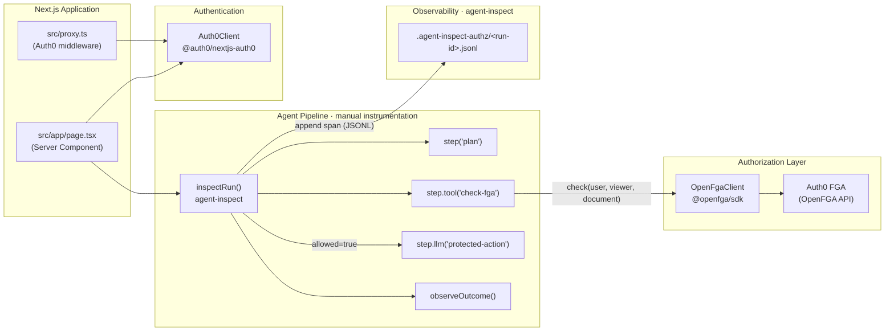

# PoC Plan: Tracing Agent Execution with FGA in Action

## Purpose

Confirm that tracing can be performed while Auth0 FGA (Fine-Grained Authorization) is actively gating document retrieval inside an agent pipeline. The trace must capture the full agent lifecycle — including FGA-mediated tool calls — so that a human reviewer can audit what the agent did and verify the authorization decisions it encountered.

## Goal

Trace output is written to a local file. A human reviewer can open that file to observe the complete agent execution path — which tools were invoked, which documents were attempted, and which were allowed or denied by FGA — providing an auditable record of agent safety.

---

## Background

### Existing System

The repository implements an Authorization-for-RAG pattern:

1. A Next.js + Auth0 OIDC layer authenticates the user via `@auth0/nextjs-auth0`.
2. `src/app/page.tsx` is a Next.js Server Component that reads the session, initializes an FGA client, and runs the agent pipeline.
3. The pipeline performs a `viewer` relation check per document against Auth0 FGA (OpenFGA) before allowing downstream agent steps.
4. The pipeline is implemented using manual instrumentation (no LangChain or LangGraph).

### Why Manual Instrumentation Instead of LangChain

The `@agent-inspect/langchain` integration was originally considered but ruled out: its peer dependency on `langchain` is significantly ahead of the version required by `@auth0/ai-langchain`. Using the LangChain callback approach would create an irreconcilable dependency conflict between the two libraries.

Instead, `agent-inspect`'s framework-agnostic manual API (`inspectRun`, `step`, `observeOutcome`) is used directly, which has no such constraint.

### Tracing Tool

**[agent-inspect](https://github.com/rajudandigam/agent-inspect)** is a local-first debugger for TypeScript/JavaScript AI agents. When used with its manual instrumentation API, it captures:

- Explicit pipeline steps (plan, tool calls, LLM calls)
- Step outcomes with pass/fail status and evidence
- Custom metadata attached at each step

Traces are written as JSONL files to a configurable directory in the project root. No external collector or API key is required.

Reference: [Manual instrumentation guide](https://github.com/rajudandigam/agent-inspect/blob/main/docs/GETTING-STARTED.md#3-manually-instrument-custom-flows)

---

## Architecture

The diagram below shows the static component relationships. `agent-inspect` spans are recorded inline via `inspectRun`/`step` calls — it has no dependency on the FGA or Auth0 components, and those components have no knowledge of it.



### Component Roles

| Component | Role in PoC |
|-----------|-------------|
| `src/app/page.tsx` | Next.js Server Component; runs the full agent pipeline per request |
| `src/proxy.ts` | Auth0 middleware wired into Next.js `middleware.ts` |
| `src/lib/auth0.ts` | Shared `Auth0Client` instance |
| `src/lib/schemas.ts` | Zod schemas for FGA config and check response |
| `inspectRun` / `step` / `observeOutcome` | Manual pipeline instrumentation from `agent-inspect` |
| `OpenFgaClient` (`@openfga/sdk`) | Performs the FGA `check` call directly |
| Auth0 FGA (OpenFGA) | Ground truth for authorization |
| `.agent-inspect-authz/<run-id>.jsonl` | Immutable, human-readable audit trail written locally |

Key design point: the pipeline is instrumented at each logical step boundary. The FGA check is wrapped in `step.tool("check-fga")`, so the trace records the tool invocation and its implicit outcome (the `allowed` boolean) even though no LangChain abstraction is involved.

---

## Scope

This PoC is limited to verifying observability. It does **not** change authorization logic, add new FGA policies, or modify the application's authentication flow.

---

## Success Criteria

| # | Criterion |
|---|-----------|
| 1 | `agent-inspect` is installed and its manual API (`inspectRun`, `step`, `observeOutcome`) is wired into the Next.js Server Component pipeline. |
| 2 | A trace file is written under `.agent-inspect-authz/` after a single page load for an authenticated user. |
| 3 | The trace contains a `check-fga` tool step entry corresponding to the FGA authorization check. |
| 4 | The trace contains a `protected-action` LLM step entry only when FGA returns `allowed: true`. |
| 5 | `observeOutcome` records pass/fail status that correlates with the FGA decision. |
| 6 | A human reviewer can open the JSONL file and reconstruct the agent's decision path without access to runtime logs. |

---

## Implementation Steps

### Step 1 — Prepare Auth0 Tenant

Sign up for a free Auth0 development account at [auth0.com](https://auth0.com). The free plan supports up to 25,000 monthly active users and includes Auth0 FGA, which is sufficient for this PoC.

After signing up:

1. Note your **tenant domain** (e.g. `dev-xxxx.us.auth0.com`) — this becomes `AUTH0_DOMAIN` in `.env.local`.
2. In the Auth0 dashboard, navigate to **Fine-Grained Authorization** and create a new FGA store. Note the **Store ID** — this becomes `FGA_STORE_ID` and `TF_VAR_fga_store_id`.
3. In the FGA store settings, create a client credential (client ID + secret) for machine-to-machine access — these become `FGA_CLIENT_ID` and `FGA_CLIENT_SECRET`.
4. In the Auth0 dashboard, create a Machine-to-Machine application for Terraform to manage Auth0 resources. Grant it the **Auth0 Management API** with all required scopes. Note its **client ID and secret** — these become `AUTH0_CLIENT_ID` and `AUTH0_CLIENT_SECRET` for Terraform (set in `infra/.envrc`).

### Step 2 — Provision Resources with Terraform

The `infra/` directory contains Terraform configuration that provisions all required Auth0 and FGA resources:

| Resource              | What it creates                                                                                                                                       |
|-----------------------|-------------------------------------------------------------------------------------------------------------------------------------------------------|
| `auth0_clients.tf`    | `ai_agent` — a Regular Web App with callback `http://localhost:3000/callback`                                                                         |
| `auth0_connection.tf` | Enables the default Username-Password database for all relevant clients                                                                               |
| `auth0_users.tf`      | `john.doe@test.com` (FGA-authorized) and `joe.shmoe@test.com` (not authorized)                                                                        |
| `openfga.tf`          | Authorization model (user/document with `owner`/`viewer` relations) and a `viewer` tuple granting `john.doe@test.com` access to `document:public-doc` |

Before running Terraform, populate `infra/.envrc` with the following variables:

| Variable               | Used by                            | Purpose                                                   |
|------------------------|------------------------------------|-----------------------------------------------------------|
| `AUTH0_DOMAIN`         | `provider "auth0"`                 | Tenant domain the Auth0 provider connects to              |
| `AUTH0_CLIENT_ID`      | `provider "auth0"`                 | Client ID of the Terraform M2M app (Management API)       |
| `AUTH0_CLIENT_SECRET`  | `provider "auth0"`                 | Client secret of the Terraform M2M app                    |
| `FGA_API_URL`          | `provider "openfga"`               | OpenFGA API endpoint (e.g. `https://api.us1.fga.dev`)     |
| `FGA_API_TOKEN_ISSUER` | `provider "openfga"`               | Token issuer for FGA client credentials                   |
| `FGA_API_AUDIENCE`     | `provider "openfga"`               | Audience for FGA client credential token requests         |
| `FGA_CLIENT_ID`        | `provider "openfga"`               | FGA client credential ID for provider authentication      |
| `FGA_CLIENT_SECRET`    | `provider "openfga"`               | FGA client credential secret for provider authentication  |
| `TF_VAR_fga_store_id`  | `var.fga_store_id` in `openfga.tf` | FGA store to create the authorization model and tuples in |

Then run:

```bash
cd infra
direnv allow          # or: source .envrc
terraform init
terraform apply
```

After `apply` completes, populate `.env.local` under the root directory with the following variables.  
It will be used by the Next.js application:

| Variable               | Used by                       | Purpose                                                                                    | Where to get it                                           |
|------------------------|-------------------------------|--------------------------------------------------------------------------------------------|-----------------------------------------------------------|
| `AUTH0_DOMAIN`         | `@auth0/nextjs-auth0`         | Tenant domain for OIDC                                                                     | Auth0 dashboard — tenant settings                         |
| `AUTH0_CLIENT_ID`      | `@auth0/nextjs-auth0`         | Default web app client ID (the pre-existing default client, **not** the Terraform M2M app) | Auth0 dashboard — Applications → Default App              |
| `AUTH0_CLIENT_SECRET`  | `@auth0/nextjs-auth0`         | Secret for the default web app client                                                      | Auth0 dashboard — Applications → Default App              |
| `AUTH0_SECRET`         | `@auth0/nextjs-auth0`         | Session encryption key                                                                     | Generate: `openssl rand -hex 32`                          |
| `APP_BASE_URL`         | `@auth0/nextjs-auth0`         | Callback base URL                                                                          | `http://localhost:3000` for local dev                     |
| `FGA_API_URL`          | `OpenFgaClient` in `page.tsx` | OpenFGA API endpoint                                                                       | Auth0 FGA store settings                                  |
| `FGA_API_TOKEN_ISSUER` | `OpenFgaClient` in `page.tsx` | Token issuer for FGA client credentials                                                    | Auth0 FGA store settings                                  |
| `FGA_API_AUDIENCE`     | `OpenFgaClient` in `page.tsx` | Audience for FGA token requests                                                            | Auth0 FGA store settings                                  |
| `FGA_CLIENT_ID`        | `OpenFgaClient` in `page.tsx` | FGA client credential ID                                                                   | Auth0 FGA store settings                                  |
| `FGA_CLIENT_SECRET`    | `OpenFgaClient` in `page.tsx` | FGA client credential secret                                                               | Auth0 FGA store settings                                  |
| `FGA_STORE_ID`         | `OpenFgaClient` in `page.tsx` | FGA store ID                                                                               | Auth0 FGA dashboard (same value as `TF_VAR_fga_store_id`) |

### Step 3 — Install Packages

```bash
npm install agent-inspect @openfga/sdk
```

No additional infrastructure is needed. `agent-inspect` runs entirely locally.

### Step 4 — Initialize agent-inspect

```bash
npx agent-inspect init --yes
```

This confirms the output directory is ready. Because manual instrumentation is used, no framework-specific adapter (e.g., `@agent-inspect/langchain`) is needed.

### Step 5 — Wire Manual Instrumentation into the Server Component

In `src/app/page.tsx`, import the manual API and wrap the pipeline in `inspectRun`. Each logical step is declared with `step`, `step.tool`, or `step.llm`. The FGA check sits inside `step.tool`; the downstream agent action sits inside `step.llm` and is guarded by the `allowed` flag.

```ts
// src/app/page.tsx (key additions)
import { inspectRun, observeOutcome, step } from "agent-inspect";

await inspectRun("agent-call-simulation", async () => {
    await step("plan", async () => {});

    await step.tool("check-fga", async () => {
        const resp = await fgaClient.check({
            user: `user:${user?.email}`,
            object: `document:${docId}`,
            relation: "viewer",
        });
        ({ allowed } = FgaCheckResponse.parse(resp));
    });

    if (allowed) {
        await step.llm("protected-action", async () => {
            agentExecuted = true;
        });
    }

    await observeOutcome("protectedAction", {
        expectation: allowed ? "One local effect" : "No local effect",
        status: agentExecuted === allowed ? "passed" : "failed",
        method: "custom",
        actual: { agentExecuted },
        evidence: { observer: "synthetic-local-counter" },
    });
}, { traceDir: ".agent-inspect-authz", silent: true });
```

### Step 6 — Run a Test Invocation

Start the Next.js dev server and load the home page as an authenticated user who has FGA `viewer` access to `public-doc`. This exercises the allowed path. To test the denied path, use a user without `viewer` access.

```bash
npm run dev
# then open http://localhost:3000 in a browser (must be logged in via Auth0)
```

### Step 7 — Inspect the Trace File

```bash
# List produced traces
npx agent-inspect view

# Or inspect the raw JSONL directly
cat .agent-inspect-authz/<run-id>.jsonl | jq .
```

Confirm the file contains:
- A `plan` step entry
- A `check-fga` tool step entry
- A `protected-action` LLM step entry (only present when FGA allowed)
- An `observeOutcome` record with `passed`/`failed` status

### Step 8 — Validate the Auditable Record

Read through the JSONL and verify that a reviewer with no access to the live system can determine:

- Which user identity was used (`user:email` string passed to `fgaClient.check`)
- Which document was checked (`document:public-doc`)
- Whether the FGA check allowed or denied the request
- Whether the protected agent action ran
- The overall pass/fail outcome

---

## File Layout After PoC

```
auth0-for-ai-agents/
├── .agent-inspect-authz/         # auto-created by agent-inspect at runtime
│   └── <run-id>.jsonl            # one file per inspectRun invocation
├── src/
│   ├── app/
│   │   └── page.tsx              # Server Component with manual instrumentation
│   ├── lib/
│   │   ├── auth0.ts              # Auth0Client instance
│   │   └── schemas.ts            # Zod schemas: FgaConfig, FgaCheckResponse
│   ├── components/
│   │   ├── LoginButton.tsx
│   │   ├── LogoutButton.tsx
│   │   └── Profile.tsx
│   └── proxy.ts                  # Auth0 middleware (wired via middleware.ts)
├── docs/
│   └── fga-tracing-poc.md        # this document
└── package.json                  # agent-inspect + @openfga/sdk added
```

---

## Insight
After running the test, below are the results of `npx agent-inspect list` and `npx agent-inspect report`.

```markdown
$ npx agent-inspect list --dir .agent-inspect-authz
Recent AgentInspect Runs
✓ run_Er74Ckogqq | agent-call-simulation | 993ms | 2026-09-24 21:44:58 
✓ run_AFFHzLKUWA | agent-call-simulation | 977ms | 2026-09-24 21:44:28 (b)
✓ run_X5GiBg9GzX | agent-call-simulation | 1.04s | 2026-09-24 21:44:17 (a)

Showing 3 of 3 runs
Trace directory: .agent-inspect-authz
```

For case(a), `john.doe@test.com` has `viewer` access to `public-doc` thus the user is allowed to run the agent.

```markdown
$ npx agent-inspect report run_X5GiBg9GzX --dir .agent-inspect-authz --section observations
## Observed outcomes

Total: 1 (passed 1, failed 0, unknown 0, skipped 0)

| Name            | Status | Expectation    | Method |
|-----------------|--------|----------------|--------|
| protectedAction | passed | Agent executed | custom |
```

For case(b), `joe.shmoe@test.com` does not have `viewer` access to `public-doc` thus the user is denied access.
```markdown
$ npx agent-inspect report run_AFFHzLKUWA --dir .agent-inspect-authz --section observations
## Observed outcomes

Total: 1 (passed 1, failed 0, unknown 0, skipped 0)

| Name            | Status | Expectation        | Method |
|-----------------|--------|--------------------|--------|
| protectedAction | passed | Agent unauthorized | custom |
```

From the result, the pipeline can be traced using `agent-inspect` and the trace file can be used to audit the authorization decisions.

## References

- [agent-inspect GitHub](https://github.com/rajudandigam/agent-inspect)
- [agent-inspect manual instrumentation guide](https://github.com/rajudandigam/agent-inspect/blob/main/docs/GETTING-STARTED.md#3-manually-instrument-custom-flows)
- `OpenFgaClient` FGA check — `src/app/page.tsx:44-51`
- FGA config and response schemas — `src/lib/schemas.ts`
- Auth0 session — `src/lib/auth0.ts`
