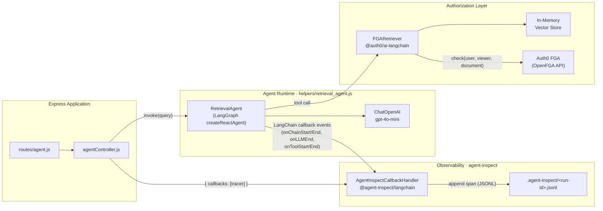

# PoC Plan: Tracing Agent Execution with FGA in Action

## Purpose

Confirm that tracing can be performed while Auth0 FGA (Fine-Grained Authorization) is actively gating document retrieval inside a LangGraph agent. The trace must capture the full agent lifecycle — including FGA-mediated tool calls — so that a human reviewer can audit what the agent did and verify the authorization decisions it encountered.

## Goal

Trace output is written to a local file. A human reviewer can open that file to observe the complete agent execution path — which tools were invoked, which documents were attempted, and which were allowed or denied by FGA — providing an auditable record of agent safety.

---

## Background

### Existing System

The repository implements an Authorization-for-RAG pattern:

1. An Express + Auth0 OIDC layer authenticates the user.
2. `controllers/agentController.js` loads documents from `/assets`, builds an in-memory vector store, and wraps it in an `FGARetriever` from `@auth0/ai-langchain`.
3. The retriever enforces a `viewer` relation check per document against Auth0 FGA (OpenFGA) before returning any content to the agent.
4. A `RetrievalAgent` (`helpers/retrieval_agent.js`) runs via LangGraph's `createReactAgent`, receiving the FGA-gated retriever as its only tool.

### Tracing Tool

**[agent-inspect](https://github.com/rajudandigam/agent-inspect)** is a local-first debugger for TypeScript/JavaScript AI agents that integrates with LangChain/LangGraph via callbacks. It captures:

- Nested LangGraph step execution
- LLM invocations (model, token counts, duration)
- Tool calls and their outcomes
- Causal failure chains and errors

Traces are written as JSONL files to `.agent-inspect/` in the project root. No external collector or API key is required.

---

## Architecture

The diagram below shows the static component relationships. agent-inspect attaches as a passive observer via the LangChain callback interface — it has no dependency on the FGA or retrieval components, and those components have no knowledge of it.



### Component Roles

| Component | Role in PoC |
|-----------|-------------|
| `RetrievalAgent` (`helpers/retrieval_agent.js`) | LangGraph agent; the unit under observation |
| `AgentInspectCallbackHandler` | Passive observer; receives every LangChain event via the callback protocol and writes spans to disk |
| `FGARetriever` (`@auth0/ai-langchain`) | Enforces `viewer` relation per document; its allow/deny decisions surface as the tool's output content |
| Auth0 FGA (OpenFGA) | Ground truth for authorization; called once per candidate document |
| `.agent-inspect/<run-id>.jsonl` | Immutable, human-readable audit trail written locally |

Key design point: agent-inspect is wired at the `invoke` call-site via `{ callbacks: [tracer] }`. It never intercepts the FGA HTTP call directly — it captures what the agent sees: the tool input (the query) and the tool output (the filtered document list). That output implicitly records FGA's decision for each document.

---

## Scope

This PoC is limited to verifying observability. It does **not** change authorization logic, add new FGA policies, or modify the application's authentication flow.

---

## Success Criteria

| # | Criterion |
|---|-----------|
| 1 | `agent-inspect` is initialized and its LangChain callback is wired into the existing `RetrievalAgent`. |
| 2 | A trace file is written under `.agent-inspect/` after a single agent invocation. |
| 3 | The trace contains at least one tool call entry corresponding to the FGA-gated retrieval step. |
| 4 | The trace distinguishes between authorized retrievals (documents returned) and unauthorized ones (empty content / FGA denial). |
| 5 | A human reviewer can open the JSONL file and reconstruct the agent's decision path without access to runtime logs. |

---

## Implementation Steps

### Step 1 — Install Packages

```bash
npm install agent-inspect @agent-inspect/langchain
```

No additional infrastructure is needed. agent-inspect runs entirely locally.

### Step 2 — Initialize agent-inspect

```bash
npx agent-inspect init --framework langgraph --yes
```

This generates a minimal config in the project root and confirms the `.agent-inspect/` output directory.

### Step 3 — Wire the Callback into RetrievalAgent

In `helpers/retrieval_agent.js`, import the LangChain callback and pass it to `createReactAgent` (or the agent's `invoke` call) via the `callbacks` option.

```js
// helpers/retrieval_agent.js  (diff-style — additions only)
import { AgentInspectCallbackHandler } from '@agent-inspect/langchain';

// Inside RetrievalAgent or its invoke wrapper:
const tracer = new AgentInspectCallbackHandler();

const agentExecutor = createReactAgent({ llm, tools, prompt });

const result = await agentExecutor.invoke(
  { messages: [new HumanMessage(query)] },
  { callbacks: [tracer] }          // <-- add this
);
```

The callback captures every LangGraph node transition, LLM call, and tool invocation automatically.

### Step 4 — Run a Test Invocation

Trigger the `/agent/call` endpoint as a user who has FGA `viewer` access to `public-doc` but **not** `private-doc`. This exercises the mixed-authorization path (one allowed, one denied).

```bash
# With a running dev server:
curl -b <session-cookie> http://localhost:3000/agent/call
```

Alternatively, write a standalone script that calls `agentController` directly with a mocked authenticated user, which avoids the need for a live Auth0 session during PoC testing.

### Step 5 — Inspect the Trace File

```bash
# List produced traces
npx agent-inspect view

# Or inspect the raw JSONL directly
cat .agent-inspect/<run-id>.jsonl | jq .
```

Confirm the file contains:
- An entry for the retrieval tool call
- Token/duration metadata for the LLM step
- The tool's output (document content or empty, indicating FGA denial)

### Step 6 — Validate the Auditable Record

Read through the JSONL and verify that a reviewer with no access to the live system can determine:

- Which user identity was used (`user:email` string passed to FGARetriever)
- Which documents were checked (`document:public-doc`, `document:private-doc`)
- Which retrieval succeeded and which was blocked
- The final answer returned by the agent

---

## Risks and Mitigations

| Risk | Mitigation |
|------|-----------|
| `agent-inspect` callback is not invoked because `FGARetriever` wraps the inner retriever opaquely | Verify by checking whether the tool call node appears in the trace; if absent, wrap the retriever tool in a thin LangChain `Tool` class that adds its own callback span. |
| FGA denial produces no distinguishable trace entry (empty string vs. error) | Log the retriever's raw return value in the tool output; agent-inspect records tool outputs verbatim, so an empty string is still visible. |
| JSONL file grows unbounded in a long-running server | Out of scope for PoC; note for follow-up that agent-inspect supports `bundle` with redaction and rotation. |

---

## File Layout After PoC

```
auth0-for-ai-agents/
├── .agent-inspect/           # auto-created by agent-inspect init
│   └── <run-id>.jsonl        # one file per agent run
├── helpers/
│   └── retrieval_agent.js    # modified: AgentInspectCallbackHandler added
├── poc/
│   └── fga-tracing-poc.md    # this document
└── package.json              # agent-inspect + @agent-inspect/langchain added
```

---

## References

- [agent-inspect GitHub](https://github.com/rajudandigam/agent-inspect)
- [agent-inspect LangGraph integration guide](https://github.com/rajudandigam/agent-inspect/blob/main/docs/LANGGRAPH.md)
- `@auth0/ai-langchain` FGARetriever — `controllers/agentController.js:27-46`
- RetrievalAgent implementation — `helpers/retrieval_agent.js`
